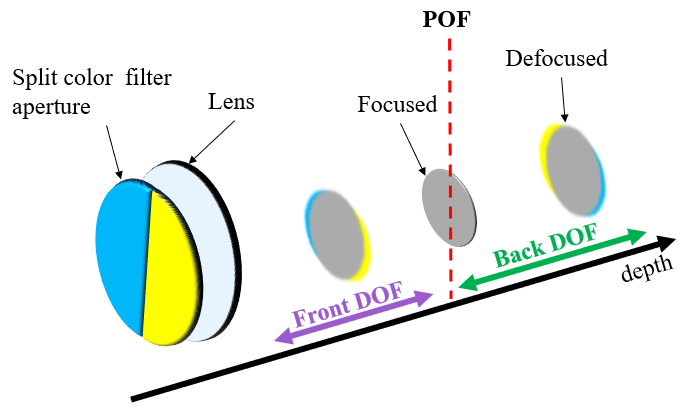
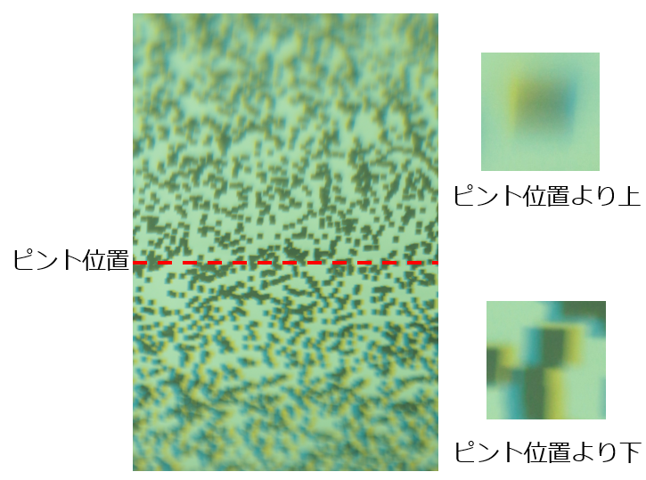
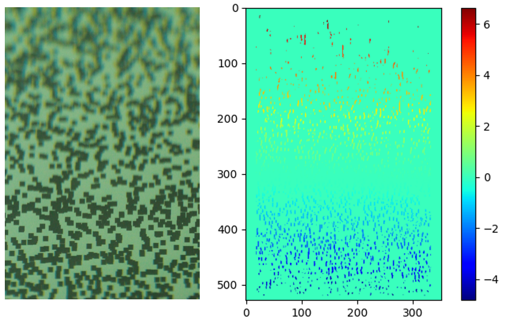
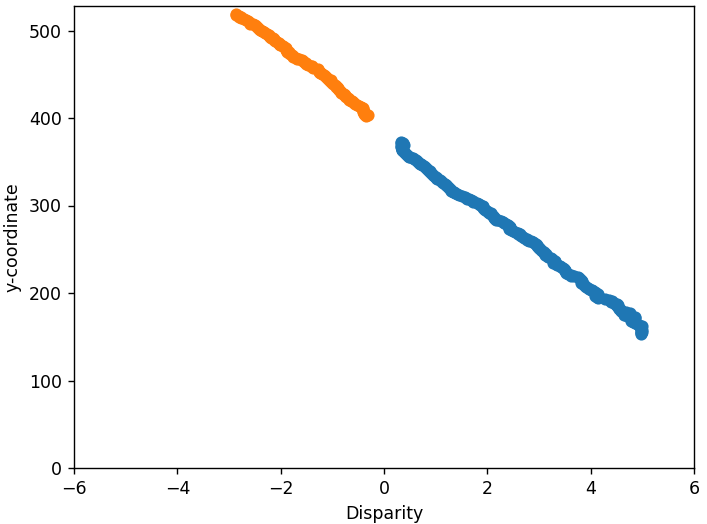
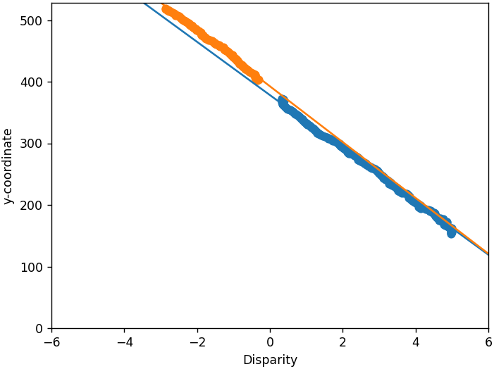
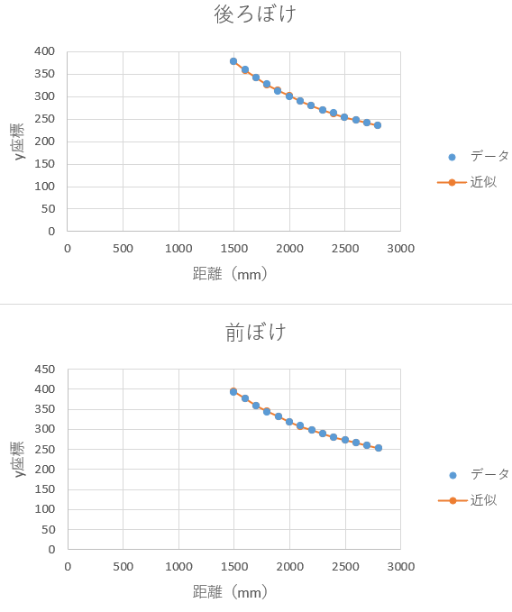
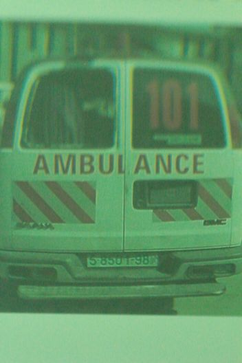
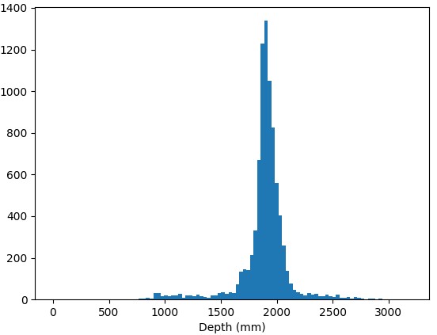
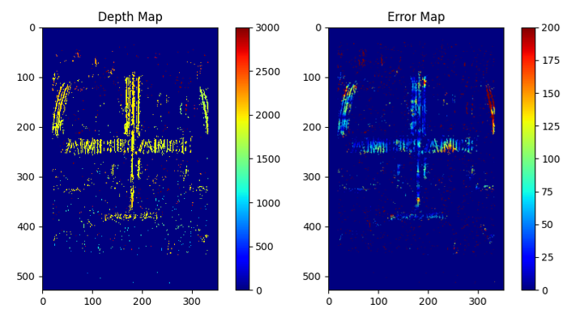

# ティルトレンズを用いた距離推定
本レポジトリは「ティルトレンズを用いた距離推定」を研究テーマとした人向けの入門資料です。

## 使用機材
カメラはEOS 60D、レンズはFUJIFILM FUJINON SWD 90mm F5.6を使用している。

## 先鋭度ベースの距離推定
ベースの理論となる[DEPTH ESTIMATION FOR AUTOMOTIVE WITH TILTED OPTICS IMAGING ](https://projet.liris.cnrs.fr/imagine/pub/proceedings/ICIP-2014/Papers/1569916145.pdf)(Hiroshi Ikeokaらによる)の実装を目的としている。

## 1. 鮮鋭度比の算出

## 2. 鮮鋭度比曲線の作成

## 3. ガウスフィッティング

## 4. 参照式の作成

## 5. 距離推定

## 参考文献

## 視差ベースの距離推定
ティルトレンズと左右に異なる色を配置したカラーフィルタ開口（分割型CF開口）を用いた距離推定手法の実装の実装を目的としている（下図は通常の光学系の場合の色ずれの概要）。なお、今回は水色と黄色で構成された分割型CF開口を使用している。

ティルトレンズと分割型CF開口を使用した場合、以下のような色ずれが発生した画像を取得できる。

色ずれには２つの性質がある
1. ぼけ量が大きいほど大きな色ずれが発生する
2. ピント位置より上側と下側で色ずれが反転して発生する

本手法ではこの2つの性質を活用する
1. ぼけ量が大きいほど大きな色ずれが発生する  
    ⇒ 色のずれ量をステレオマッチングにより求めることで視差（ぼけ量）を算出する
2. ピント位置より上側と下側で色ずれが反転して発生する  
    ⇒ ぼけた被写体がピント位置より前（下）にあるか後ろ（上）にあるかの不確実性の解決

## 1. 視差の算出
[disparity.py](./disparity.py)に実装。  
被写体はイメージセンサに対して平行に設置したホワイトノイズ画像を用いている。

下図は被写体のホワイトノイズ画像と視差算出後の視差マップである。
  
図より視差はホワイトノイズ画像の垂直方向エッジ部しか得られないことが分かる。  
これは色ずれが横方向にしか発生せず、水平方向のエッジ部では視差算出の手掛かりが得られない為である。
また、視差の符号により前後（上下）ぼけの判別が可能であることも分かる。
## 2. 視差（ぼけ量）変化のモデル化
[calibration.py](./calibration.py)に実装。  
ティルトレンズ用いた場合、視差（ぼけ量）はy座標と距離によって変化する。そこで距離は固定し、視差のy座標方向の変化をモデル化する。

まず、[セクション1](#1-視差の算出)で取得した視差マップを各y座標方向に平均値を算出する。下図に平均値のプロットを示す。
  
オレンジのプロットが前ぼけ、青のプロットが後ろぼけを表す。

次に、取得したプロットについて以下の式を用いて、前ぼけ後ろぼけ別々で直線フィッティングを行う。  
$y=ad+b...(1)$  
ここで $y$はｙ座標、 $d$は視差を表す。フィッティング結果を下図に示す

[セクション1](#1-視差の算出)の処理と本セクションのモデル化を距離毎に行い、各距離で「2つの直線の傾き」と、「視差が0の場合のy座標」を記録しておく。
実装ではparams.csvに記録されている。

## 3. 参照式の作成
距離推定式は次のようになる  
$z=v_i/(y-\overline{a_i}d-u_i)+w_i,i=f,b...(2)$  
なお、 $z$は距離値、 $y$はｙ座標、 $d$は視差、 $\overline{a}$は各距離の直線の傾きの平均値、 $v$、 $u$、 $w$はパラメータ、 $i$は前ぼけ（ $f$ ）もしくは後ろけ（ $b$ ）を表す。

ここで、視差が0の場合の式(2)をyについて解く  
$y=(w_iu_i-u_iz-v_i)/(w_i-z)...(3)$  
各距離の視差0のy座標について、式(3)を用いて前ぼけ後ろぼけそれぞれでフィッティングを行う。なお、参照式は[参照式作成.xlsx](csv/参照式作成.xlsx)で作成している。  

このフィッティングで得られたパラメータ $v_f$、 $u_f$、 $w_f$、 $v_b$、 $u_b$、 $w_b$と直線の傾きの平均値 $\overline{a_f}$ 、 $\overline{a_b}$ を保持しておく。

今回使用したパラメータは以下の通りである。  
$v_f = 455756.211142968$  
$u_f = 90.4626116573327$  
$w_f = 0$  
$\overline{a_f} = -43.5302$  
$v_b = 463188.704432995$  
$u_b = 68.9522453187647$  
$w_b = 0$  
$\overline{a_b} = -42.9284$
## 4. 距離推定
[depth.py](./depth.py)に実装。  
[セクション3](#3-参照式の作成)で得た8つのパラメータ、注目画素の視差とy座標を式(2)に入力することで距離マップを得る。

テスト用画像としてImageNet Dataset[1]から抽出した画像をターゲットボードに貼り付け撮影したものを使用する。  
  
なお、正解距離は1934mmである。

推定距離値の平均値と絶対平均誤差は次のようになった。  
平均推定距離値（mm）: 2016.4  
絶対平均誤差（mm）: 1584.3

距離推定結果のヒストグラムを示す。  

以下は推定距離マップと誤差マップである。

## 参考文献
[1] H. Addison, P. Eunbyung, and K. Wendy, ImageNet Object Localization Challenge. Kaggle. https://kaggle.com/competitions/imagenet-object
localization-challenge, 2018. 
